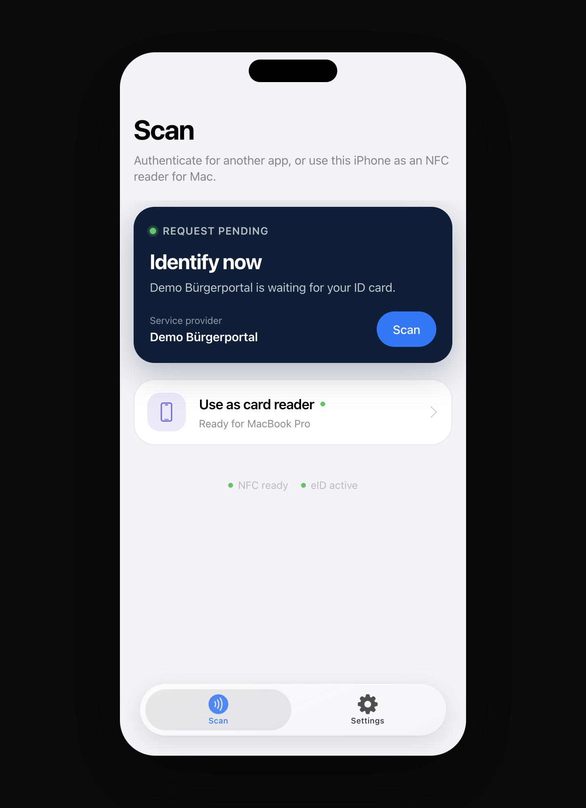
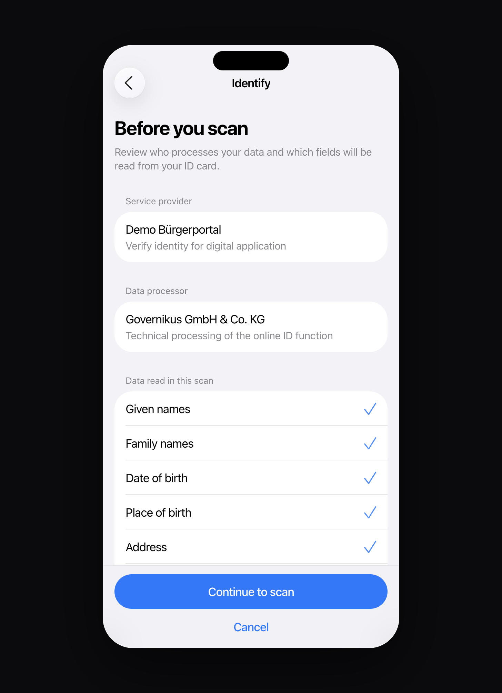
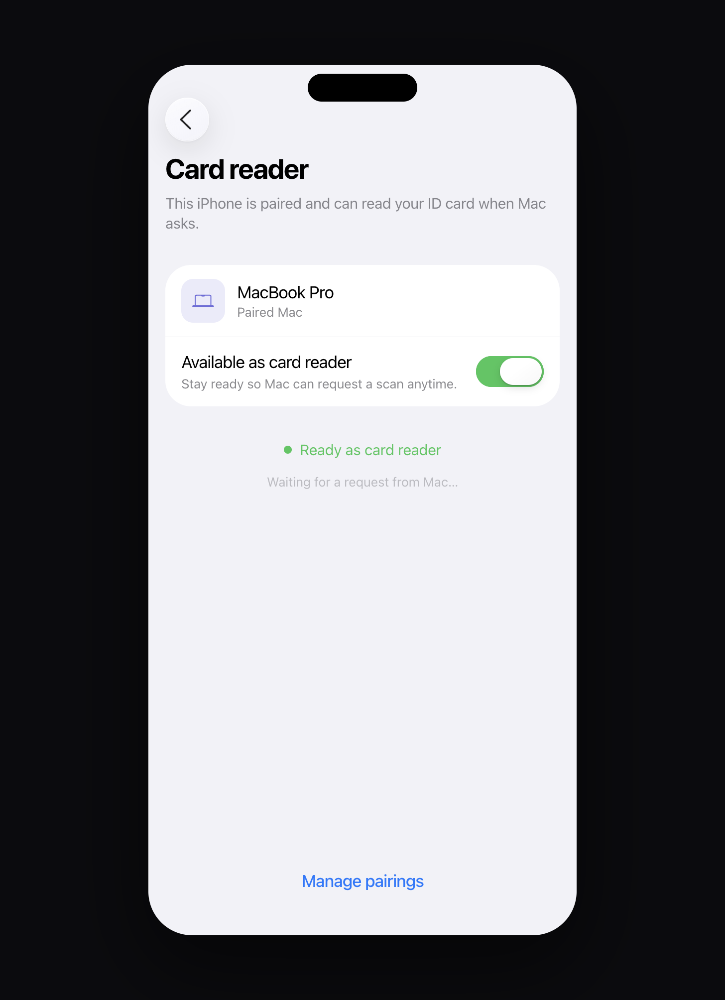
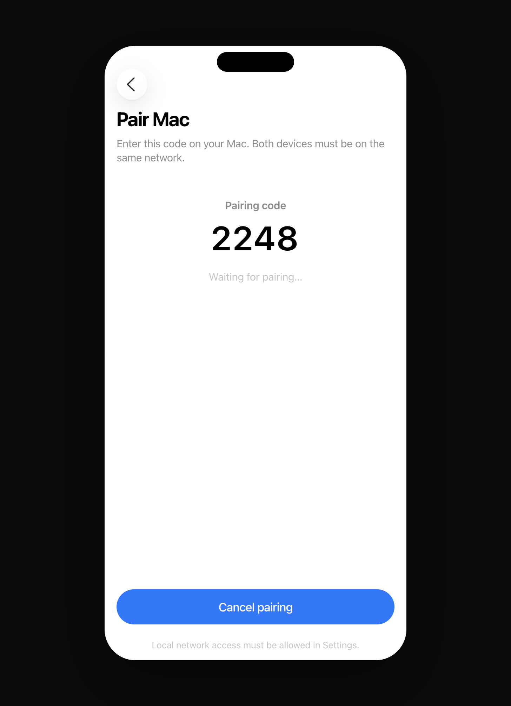
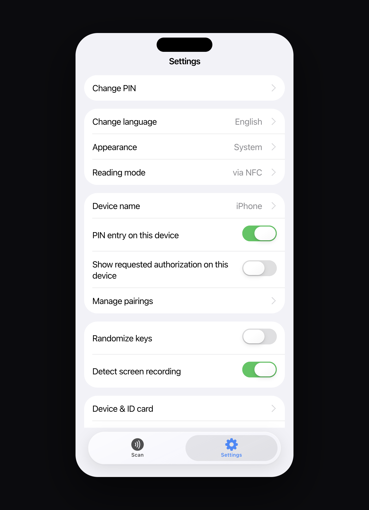
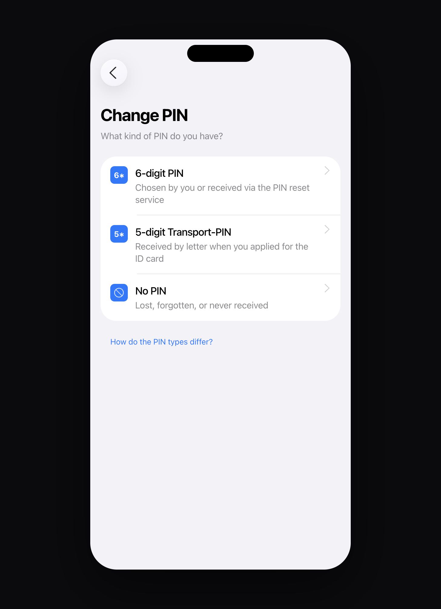
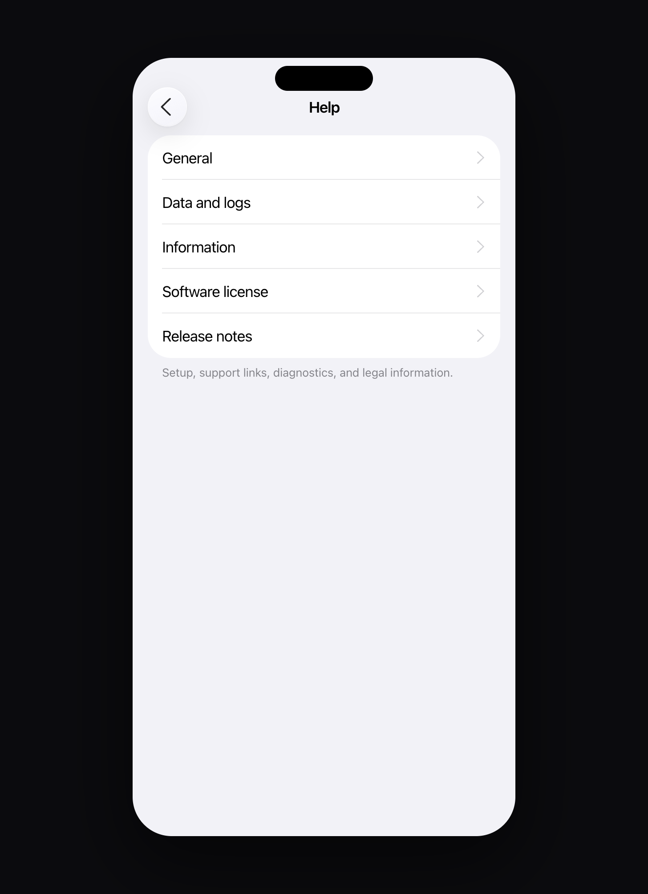

# AusweisApp — web redesign proposal

> **Unofficial design exploration.** This project is **not** the official [AusweisApp](https://www.ausweisapp.bund.de/) and is **not** affiliated with Governikus GmbH & Co. KG or the German government. It is a **redesign proposal** for a flat, iOS-aligned web demo of the AusweisApp experience, built with the help of AI.

A React web prototype of the German AusweisApp mobile flows: online identification, smartphone-as-card-reader pairing, PIN change, device checks, settings, and help — with DE/EN localization and a simulated NFC sheet.

## Screenshots

| Home (Scan) | Identify (consent) |
| --- | --- |
|  |  |

| Card reader | Pair Mac |
| --- | --- |
|  |  |

| Settings | Change PIN |
| --- | --- |
|  |  |

| Help |
| --- |
|  |

## What this explores

- **Identify online** — provider consent → NFC sheet → card PIN → success
- **Phone as card reader** — show a pairing code for Mac, then stand by for scan requests
- **Change PIN** — choose 6-digit / Transport-PIN / no PIN before entry
- **Device & ID check**, **Settings**, and an extended **Help** section
- Simulated NFC states (ready / reading / success / moved-away / timeout)

## Run

```bash
npm install
npm run dev
```

Demo card PIN: `123456`  
Demo Transport-PIN: `12345`

## Stack

| Layer | Choice |
| --- | --- |
| App | [React](https://react.dev/) 19 + [TypeScript](https://www.typescriptlang.org/) |
| Build | [Vite](https://vite.dev/) 8 |
| Styling | [Tailwind CSS](https://tailwindcss.com/) v4 (`@tailwindcss/vite`) |
| Routing | [React Router](https://reactrouter.com/) 7 |
| Motion | [Motion](https://motion.dev/) (`motion`) |
| Icons | [sf-symbols-lib](https://github.com/phranck/sf-symbols-lib) (SF Symbols as React components) |
| Lint | [oxlint](https://oxc.rs/) |

Also listed in `package.json`: [lucide-react](https://lucide.dev/) (available; primary UI icons use SF Symbols via `sf-symbols-lib`).

## License

This repository is licensed under the **[MIT License](LICENSE)** — free to use, modify, and redistribute.

### Third-party notices

- **AusweisApp**, related trademarks, and official branding belong to their respective owners (Governikus / Bund). This repo is an independent UI proposal only.
- **Apple SF Symbols** names and glyph shapes are Apple’s. Use of SF Symbols is subject to [Apple’s SF Symbols license and Human Interface Guidelines](https://developer.apple.com/sf-symbols/). The React wrappers come from **sf-symbols-lib** (see that package’s license on npm/GitHub).
- Framework and library licenses apply as published by their authors (React, Vite, Tailwind, React Router, Motion, etc.).

## Disclaimer

No real eID transactions, NFC hardware access, or personal ID data processing occurs. NFC and pairing flows are simulated for design and UX demonstration.
