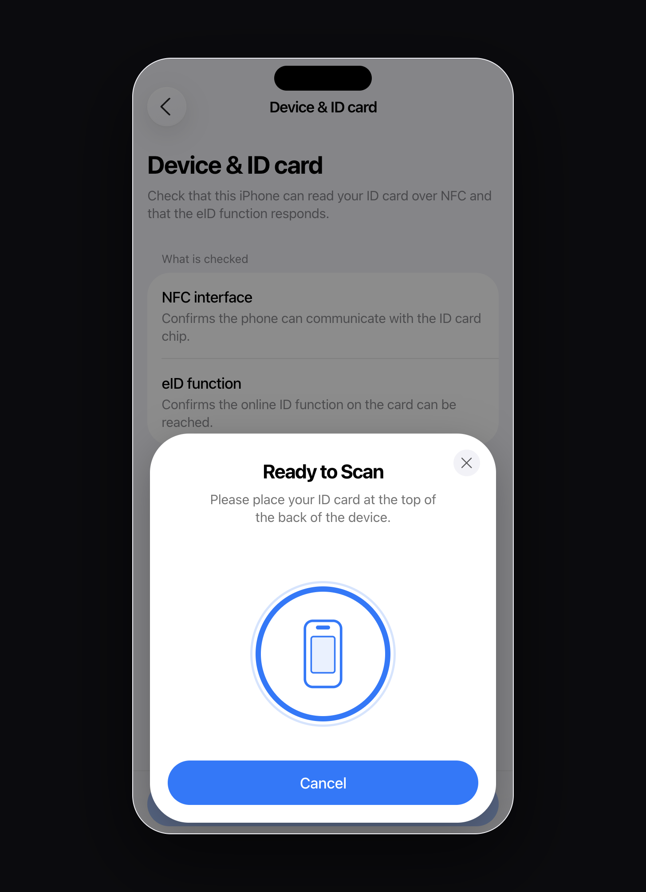
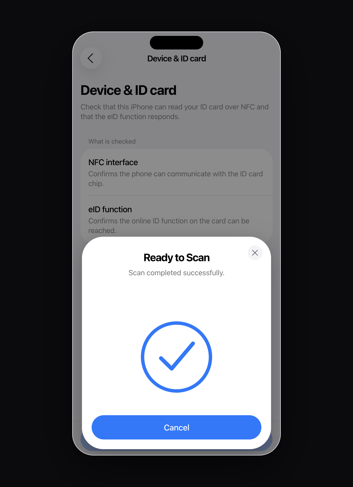
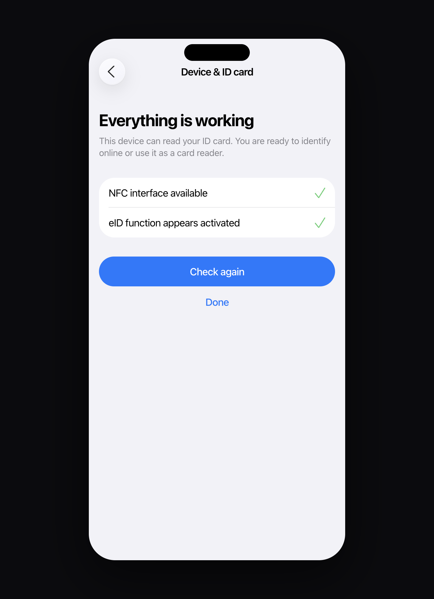

# AusweisApp — web redesign proposal

> **Unofficial design exploration.** This project is **not** the official [AusweisApp](https://www.ausweisapp.bund.de/) and is **not** affiliated with Governikus GmbH & Co. KG or the German government.

**Live demo:** [lnvglr.github.io/ausweis-web](https://lnvglr.github.io/ausweis-web/) · by [Leon Vogler](https://leonvogler.com)

## Why

Online identification asks for a high level of trust. The current AusweisApp UI and UX fall short of that: the experience feels dated and inconsistent, without a clear commitment to iOS conventions *or* to basic product craft — hierarchy, spacing, alignment, and responsive feedback.

When an authenticator looks unfinished, confidence drops before the first NFC tap. Identity software should feel intentional and native: calm screens, snappy interaction, and layouts that stay aligned under pressure.

This repo is a concrete redesign proposal — the same core flows, rebuilt as a flat, iOS-aligned web prototype so the difference can be judged hands-on.

## What this explores

A React web prototype of AusweisApp mobile flows, with DE/EN localization and a simulated NFC sheet:

- **Identify online** — provider consent → NFC sheet → card PIN → success
- **Phone as card reader** — pairing code for Mac, then standby for scan requests
- **Change PIN** — choose 6-digit / Transport-PIN / no PIN before entry
- **Device & ID check**, **Settings**, and extended **Help**
- Simulated NFC states (ready / reading / success / moved-away / timeout)

The goal is not a different product. It is a higher craft bar for the same jobs: platform-familiar chrome, quieter hierarchy, and interactions that feel finished.

## Screenshots

| Home (Scan) | Identify (consent) |
| --- | --- |
|  |  |

| Card reader | Pair Mac |
| --- | --- |
|  |  |

| Settings | Change PIN |
| --- | --- |
|  |  |

| Help | NFC scan |
| --- | --- |
|  |  |

| NFC success | Check complete |
| --- | --- |
|  |  |

## Run

```bash
npm install
npm run dev
```

Open the landing page, then **Open prototype** (or go to `/demo`).

Demo card PIN: `123456`  
Demo Transport-PIN: `12345`

## GitHub Pages

Pushes to `main` build and deploy via [`.github/workflows/deploy-pages.yml`](.github/workflows/deploy-pages.yml).

In the repo **Settings → Pages**, set Source to **GitHub Actions** (required once).

Local production build with the Pages base path:

```bash
VITE_BASE=/ausweis-web/ npm run build
npx vite preview --base /ausweis-web/
```

## Stack

| Layer | Choice |
| --- | --- |
| App | [React](https://react.dev/) 19 + [TypeScript](https://www.typescriptlang.org/) |
| Build | [Vite](https://vite.dev/) 8 |
| Styling | [Tailwind CSS](https://tailwindcss.com/) v4 (`@tailwindcss/vite`) |
| Routing | [React Router](https://reactrouter.com/) 7 |
| Motion | [Motion](https://motion.dev/) (`motion`) |
| Icons | [sf-symbols-lib](https://github.com/phranck/sf-symbols-lib) (SF Symbols as React components) |
| Lint | [oxlint](https://oxc.rs/) |

## License

This repository is licensed under the **[MIT License](LICENSE)** — free to use, modify, and redistribute.

### Third-party notices

- **AusweisApp**, related trademarks, and official branding belong to their respective owners (Governikus / Bund). This repo is an independent UI proposal only.
- **Apple SF Symbols** names and glyph shapes are Apple’s. Use of SF Symbols is subject to [Apple’s SF Symbols license and Human Interface Guidelines](https://developer.apple.com/sf-symbols/). The React wrappers come from **sf-symbols-lib** (see that package’s license on npm/GitHub).
- Framework and library licenses apply as published by their authors (React, Vite, Tailwind, React Router, Motion, etc.).

## Disclaimer

No real eID transactions, NFC hardware access, or personal ID data processing occurs. NFC and pairing flows are simulated for design and UX demonstration.
